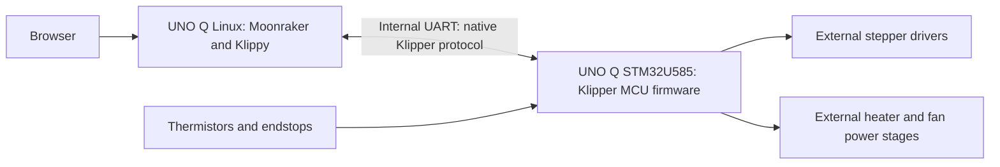

# KlipperQ: Klipper on Arduino UNO Q

An independent project bringing Klipper's Linux host and real-time motion control together on one Arduino UNO Q.

## Repositories

- [KlipperQ](https://github.com/andrewsharmon/KlipperQ) contains project plans, hardware integration, setup and recovery documentation, and validation records.
- [Klipper firmware fork](https://github.com/andrewsharmon/klipper/tree/uno-q) contains firmware development on the `uno-q` branch, with [Klipper upstream](https://github.com/Klipper3d/klipper) tracked separately.

See [the development workflow](docs/development.md) and [`firmware.lock.json`](firmware.lock.json) for the pinned firmware baseline. The pin records a source revision, not a validated UNO Q release.

## Feasibility

Feasibility assessment, 2026-09-23. **Conditional go: technically plausible, but requires an STM32U585 Klipper firmware port and a printer power/interface carrier. It is not currently a supported installation.**

The intended architecture keeps all printer computing on the UNO Q:

The browser can run on another device; it is not required to keep a print running. Motor drivers, heater switches, sensor circuits, and a printer power supply remain necessary. No Raspberry Pi or additional printer-control MCU is required by the proposed design.

Target: Andrew's custom printer, using the **2 GB UNO Q**. There is no identified requirement for the 4 GB model; the plan includes memory validation on 2 GB.

| Area | Assessment |
| --- | --- |
| Linux host | Good fit for normal Klippy, Moonraker, and a web interface; installation still needs board validation. |
| Onboard MCU | Adequate-looking compute and memory, but upstream Klipper has no STM32U585 target. |
| Internal connection | A physical UART exists; direct serial should let the host protocol remain unchanged. |
| Printer I/O | A basic four-motor printer fits a provisional header allocation. Electrical interfacing is required. |
| Main uncertainty | Correct MCU startup, clock/timer behavior, UART integration, ADC, and safe recovery. |

Read the [implementation plan](docs/implementation-plan.md), [ordered implementation and testing checklist](docs/execution-checklist.md), and [source audit](docs/source-audit.md). The conclusion is based on documentation and source inspection, **not a successful build, flash, or printing test**. No hardware was accessed or modified.

Immediate milestone: make unmodified Klippy on the UNO Q identify its onboard STM32 running a minimal Klipper port, maintain clock synchronization, and toggle one unloaded output with measured timing.
